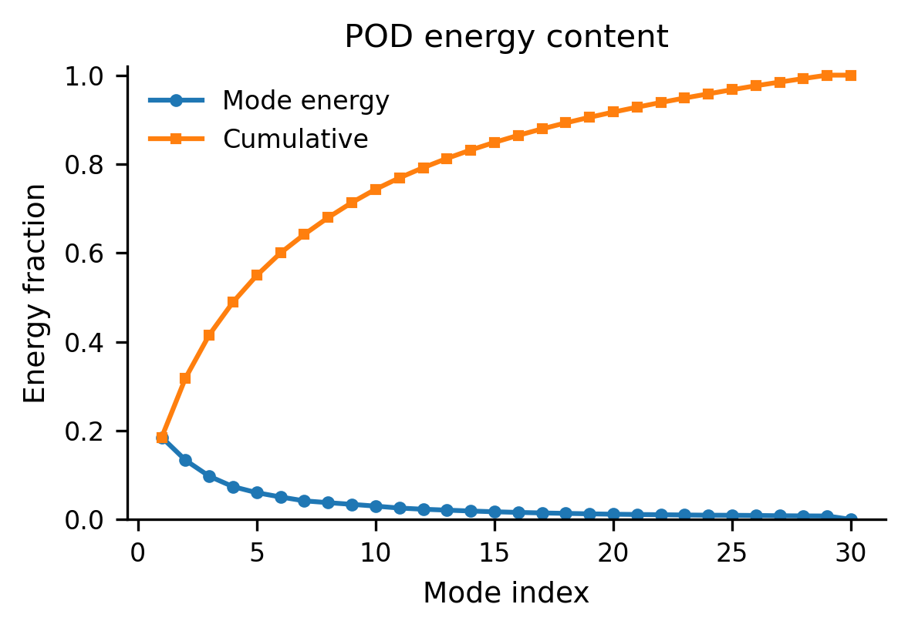
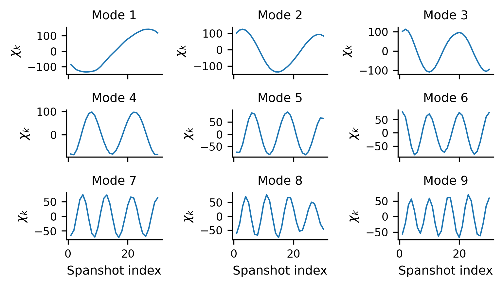
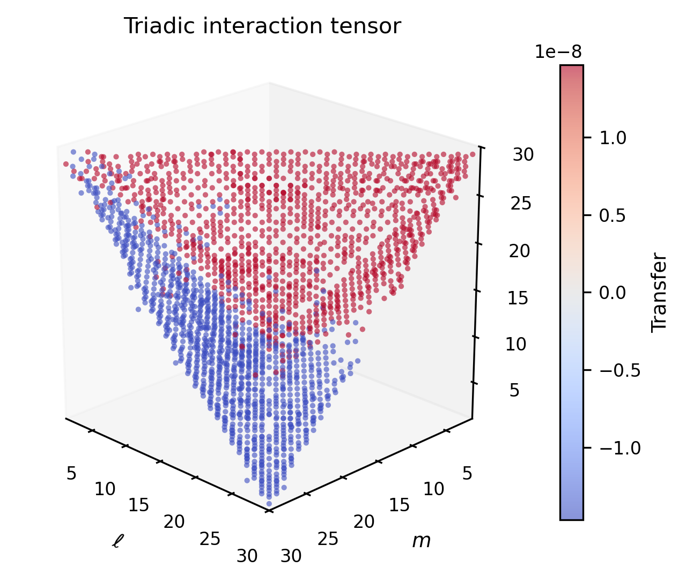

# GPU framework for computing multiscale triadic interactions

[](https://doi.org/10.5281/zenodo.20284897)
[](https://opensource.org/licenses/MIT)

This repository contains the computational framework presented in the manuscript currently under review, which focuses on GPU-accelerated computation of multiscale triadic interactions from large flow datasets.

The computation of the POD and SPOD bases and eigenvalues follows the distributed HPC frameworks of Biassoni et al. (2024) for POD and Biassoni et al. (2026) for SPOD. Their public records are available on Zenodo at [https://zenodo.org/records/13945003](https://zenodo.org/records/13945003) and at the ACROSS public aeronautics repository [https://git.mycloud-links.com/across-public/orchestrator/applications/aeronautics](https://git.mycloud-links.com/across-public/orchestrator/applications/aeronautics), respectively. Those records concern the CPU computation of the decomposition stage only and do not include the GPU triadic-interaction computation developed here.

This public repository provides the reduced workflow used for the present study, including the GPU-enabled Dask implementation for the triadic-interaction computation, a reduced public test case, example outputs, and post-processing scripts.

## Repository structure

- `hpda/`: Python source files for the POD, SPOD, and Fourier steps, the triadic interaction computation on the three bases, and the associated helper functions.
- `submission/`: example SLURM submission scripts for the reduced public workflow.
- `FLOW/`: input-data directory for the workflow. It contains the sequence file used by the reduced public test case. The full set of raw flow snapshots and the mesh are not stored directly in this GitHub repository because of their size, and can be retrieved from Zenodo at [https://doi.org/10.5281/zenodo.19481070](https://doi.org/10.5281/zenodo.19481070).
- `STATS/`: output data directory for the workflow. It contains example outputs from the POD step together with example triadic output. Some large files, such as mean fields and Parquet outputs stored in directory format, can be retrieved from Zenodo at [https://doi.org/10.5281/zenodo.19481070](https://doi.org/10.5281/zenodo.19481070).
- `Processing/`: plotting scripts and example figures showing how to import the reduced POD and triadic outputs and visualize the main quantities of interest.

## Workflow overview

The reduced public workflow follows two main stages:

1. POD computation from the reduced flow snapshots,
2. Triadic interaction computation from the POD output using a GPU-accelerated Dask workflow.

The submission scripts included in `submission/` show how these two stages can be run sequentially on an HPC system.

The repository also includes the SPOD and Fourier variants of the same workflow, used for the basis comparison in Appendix B of the associated manuscript. For SPOD, `dask_read_SPOD.py` computes a block SPOD of the snapshots (non-overlapping blocks, rectangular window, two-sided FFT), and `dask_triadic_SPOD.py` evaluates the complex triadic transfer tensor on the SPOD basis, with the temporal triple product supported on the zero-sum frequency set modulo the sampling frequency. The corresponding submission scripts are `dask_read_SPOD.sh`, `dask_triadic_SPOD.sh`, and `triadic_SPOD_pipeline.sh`. For Fourier, `dask_triadic_FOURIER.py` evaluates the same tensor on the unitary discrete Fourier transform of the snapshot record, submitted through `dask_triadic_FOURIER.sh`. The Fourier basis requires no precomputed basis file, so this variant consists of a single stage. On the Fourier basis, the temporal triple product restricts the donor index to n = (l + m) mod nt, and the spatial kernel is evaluated only on this resonant set, reducing the contraction count from nt^3 to nt^2 per spatial block. The saved tensor `py_tr_FOURIER_tot_0_2.npy` has the same shape and index convention as the POD and SPOD outputs.

## Reduced public test case

The repository includes a reduced public test case designed to reproduce the workflow on a much smaller dataset than the original production case.

The `FLOW/` directory mirrors the input data structure used by the workflow. The mesh and the sequence file required by the reduced case are provided in the repository. The raw flow snapshots themselves are not stored directly in GitHub because of their size and are instead distributed separately through Zenodo at [https://doi.org/10.5281/zenodo.19481070](https://doi.org/10.5281/zenodo.19481070).

The `STATS/` directory mirrors the output data structure used by the workflow. It contains reduced example outputs from the POD step, including the files required as input to the triadic interaction computation, together with example triadic output.

The `Processing/` directory contains example postprocessing scripts and figures generated from the reduced public test case.

## Installation on an HPC system

The workflow was developed and tested in a module-based HPC environment using Anaconda, Dask, and CuPy. In particular, the GPU stage requires a Python environment with CUDA-aware packages.

A representative environment setup is:

1. Load the system modules required by the cluster:

    ```bash
    module purge
    module load openmpi
    module load nvhpc
    module load cuda
    module load anaconda3/2022.05
    ```

2. Initialize Conda in the shell:

    ```bash
    source $(conda info --base)/etc/profile.d/conda.sh
    eval "$(conda shell.bash hook)"
    ```

3. Create and activate a dedicated environment:

    ```bash
    conda create --yes --prefix $HOME/.conda-envs/ghpda -c conda-forge --override-channels python=3.9
    conda activate $HOME/.conda-envs/ghpda
    ```

4. Install the required packages:

    ```bash
    conda install --yes -c conda-forge --override-channels \
        dask distributed dask-mpi dask-jobqueue dask-cuda \
        cupy cuda-cudart cuda-version=12 \
        scikit-learn numpy numba h5py pyarrow pandas scipy opt_einsum
    ```

This is a cleaned version of the environment used for the GPU workflow. Cluster-specific details such as account names, partitions, and module names will need to be adapted by the user.

## Running the reduced workflow

The submission scripts in `submission/` illustrate the intended execution order:

1. run the POD step,
2. run the triadic step using the POD outputs,
3. Optionally submit both in sequence with the provided pipeline script.

The exact commands depend on the local SLURM configuration, but the directory structure expected by the scripts is already reflected in this repository.

## Example figures

The `Processing/` directory contains example post-processing scripts and figures generated from the reduced public test case.

- modal energy distribution and cumulative energy content,
- temporal coefficients from the POD step,
- a reduced 3D representation of the triadic interaction tensor.

These examples are included as lightweight checks of the public workflow rather than as exhaustive results for the full production dataset.

### POD energy content



### Temporal coefficients



### Triadic interaction cube



## Notes on post-processing

The plotting scripts used for the example figures rely on reduced POD outputs distributed in Parquet directory format. In our tests, reading these files was reliable with:

- Python 3.11
- pandas 2.1.4
- pyarrow 14.0.2

For this reason, a dedicated post-processing environment is recommended for the plotting stage.

## Citation

If you use this repository, please cite the archived Zenodo release:

> Lopes, G., Rosenzweig, M., Przytarski, P. J., Sandberg, R., & Lengani, D. (2026). *MSCA-COMPOSE/GPU-framework-for-computing-multiscale-triadic-interactions*. Zenodo. [https://doi.org/10.5281/zenodo.20284897](https://doi.org/10.5281/zenodo.20284897)

**DOI**: [10.5281/zenodo.20284897](https://doi.org/10.5281/zenodo.20284897)

The scientific context, methodology, and discussion of results are described in the associated manuscript:

> Lopes, G., Rosenzweig, M., Przytarski, P. J., Sandberg, R., & Lengani, D. *A GPU framework for computing multiscale triadic interactions in turbulent flows.* Submitted to *Computers & Fluids* (under review), 2026.

This entry will be updated with the journal reference and DOI upon acceptance.

## License

This repository is distributed under the MIT License.
